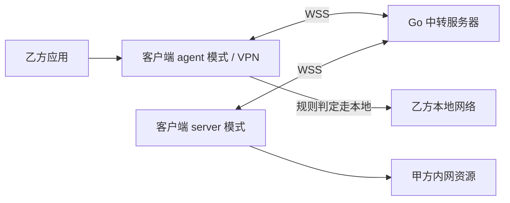

# xTunnel

xTunnel 面向乙方在外网访问甲方内网数据的场景，计划通过 Android 客户端与 Go
中转服务器建立隧道，让外网设备使用甲方网络访问内网资源。

**当前处于项目初始化阶段。** `mobile` 和 `tv` 仅包含 Compose 示例页面，`server` 仅包含 Go
控制台示例；配对、规则管理、VPN、DNS 代理及数据转发尚未实现，目前不能用于实际内网访问。

## 项目结构

| 路径                                                     | 职责                                        | 当前状态            |
|----------------------------------------------------------|---------------------------------------------|---------------------|
| [`mobile/`](mobile/)                                     | Android 手机端，适配触摸交互                | Compose 示例页面    |
| [`tv/`](tv/)                                             | Android TV 端，适配遥控器焦点交互           | TV Compose 示例页面 |
| [`server/`](server/)                                     | Go 中转服务器，负责配对、会话管理和数据转发 | 控制台示例          |
| [`gradle/libs.versions.toml`](gradle/libs.versions.toml) | Android 插件与依赖版本目录                  | 已配置              |
| [`AGENTS.md`](AGENTS.md)                                 | 已确认需求、协议边界、开发规范及验收要求    | 开发依据            |

手机端与 TV 端的目标功能一致，最低兼容 Android 8.0（API 26）。核心配对、规则、协议及 VPN 逻辑将在出现实际复用需求时共享。

## 第一版设计

以下描述为已确认的目标设计，尚未实现。完整要求见 [AGENTS.md](AGENTS.md)。

### 角色与访问链路

| 角色                 | 所在网络           | 职责                                                                 |
|----------------------|--------------------|----------------------------------------------------------------------|
| 客户端 `server` 模式 | 甲方内网           | 使用当前网络解析域名、连接目标并转发数据，不创建 VPN                 |
| 客户端 `agent` 模式  | 乙方外网           | 通过 Android `VpnService` 接管指定应用流量，按规则选择隧道或本地网络 |
| Go 中转服务器        | 双方均可访问的网络 | 下发配对码、核验规则和会话、转发控制消息与业务数据                   |



两种客户端模式均主动连接 Go 中转服务器，甲方无需开放公网入站端口。中转地址由用户填写；客户端 `server`
模式与 `server/` 中的 Go 中转服务器是不同角色。

### 主要能力

- **设备配对**：使用 `0000` 至 `9999` 的四位数字字符串，无需账号登录；支持扫码和手动输入，无摄像头的 TV
  端使用手动配对。同一轨道允许多个 agent 同时连接。
- **两端规则**：客户端 server 模式配置允许转发的范围，agent 配置本地分流规则；支持 IPv4 CIDR、域名和
  HTTP 完整 URL 正则，每端内部多条规则为“或”关系。
- **流量接入**：agent 使用系统 VPN 接入 HTTP、TCP 和 UDP，支持“全部应用”和“仅指定应用”多选范围；未选中的应用继续使用系统网络。
- **内网解析**：经 VPN DNS 代理的查询可交由客户端 server 模式使用甲方网络解析，支持内网域名和专用
  DNS；不使用 Go 中转服务器的 DNS 代替甲方解析。
- **加密通道**：管理接口使用 HTTPS + JSON，控制连接和业务通道使用 WSS；每个 TCP 业务连接使用独立数据通道，UDP
  保留数据报边界和固定目标。
- **后台运行**：两种客户端模式均由前台服务维护连接；页面退出、Activity 重建和息屏不主动停止服务。

### 规则示例与判定

| 类型          | 示例                                      | 判定方式                                                                    |
|---------------|-------------------------------------------|-----------------------------------------------------------------------------|
| IPv4 CIDR     | `10.0.0.0/8`、`192.168.1.0/24`            | 按实际目标 IPv4 地址判断                                                    |
| 域名          | `example.com`                             | 匹配域名本身及所有层级子域名，如 `api.example.com`，不匹配 `notexample.com` |
| HTTP 接口正则 | `^http://api\.example\.com:8080/private/` | 按完整 URL 查找匹配，包含非默认端口、原始路径和查询串                       |

域名统一去除首尾空白、转为小写、移除末尾的点，并将国际化域名转为 ASCII IDNA 形式。接口正则使用 Go
`regexp` 支持的 RE2 语法，两端须保持相同语义；不接受前后查找或反向引用。保存时任何一条规则无效，都拒绝整次保存。

流量先经过 agent 本地规则，再由 Go 中转服务器核验轨道规则，最后由客户端 server 模式连接甲方目标。两端均未配置规则时，进入
VPN 的流量默认走隧道。

- 明文 HTTP 按每个请求的完整 URL 预检，长连接中的后续请求也必须重新核验；请求体等待放行后流式转发。明文
  HTTP/2 同样按每个请求判定。
- HTTPS、普通 TCP、UDP 和不可解密流量仅使用可求值的 IPv4 CIDR
  与已识别域名，跳过接口正则。有可用规则时任一命中才允许；没有可用规则时默认允许隧道。例如，仅配置接口正则，或仅配置域名但域名未知，均属于没有可用规则。
- Go 中转服务器必须核验实际请求信息和甲方解析得到的候选 IPv4，不能仅信任 agent 上报的匹配结果。agent
  在发送业务数据前也须按最终实际地址复核本地规则。

### 会话与失败处理

- 配对码在同一中转服务器内全局唯一，允许前导零，不因多个 agent
  配对而被消耗，也不按时间过期。四位码仅用于配对，管理、控制及数据通道使用内部凭据与单次票据授权。
- 客户端 server 模式更新配置时，生成新码并保留当前服务会话的旧码；所有有效码均获取最新配置，同时断开旧
  agent 会话与业务通道。更新失败时保留原配置、配对码及连接。
- 客户端 server 模式服务停止后重新启动，或进程终止后重新启动服务，视为重启：撤销旧服务会话、配对码和连接。Activity
  重建、息屏及控制连接重连不属于重启。
- Go 中转服务器重启后不恢复旧会话、配对码或凭据；第一版状态保存在内存中。
- agent 本地规则未命中时走本地；已进入中转预检的请求，只有明确收到 `RULE_REJECTED`
  且尚未向甲方发送业务数据，才能改走本地。已识别域名的本地直连必须使用乙方网络重新解析。
- 目标解析失败、连接失败、超时或业务通道断开均直接报错，不自动在本地重发。单条业务通道失败不停止整个
  VPN；控制连接断开或轨道离线才停止 VPN 并清理连接。
- agent 停止 VPN 后保留配置和停止原因，后续新请求恢复使用系统网络；重新连接由用户操作，重新配对并获取当前配置，不自动恢复
  VPN。

### 第一版边界

- 仅代理 IPv4；VPN 运行期间阻断其应用范围内的 IPv6，DNS 对 AAAA 查询返回无 IPv6 地址的正常空答案。
- HTTPS 保持端到端透传，不解密 URL，不替换证书；暂不支持甲方自签名 HTTPS 证书信任适配。
- 不解密应用自带的 DoH/DoT，不从加密 DNS 猜测域名；仅按实际可获得的域名或 IP 信息判定。
- “仅指定应用”必须至少选择一个仍安装的应用；修改应用范围后重建 VPN，重建失败时保持停止。
- 不引入 QUIC、数据库或跨实例会话恢复，不启用开机自动连接或始终开启 VPN。使用时须关闭系统“阻止未经过
  VPN 的连接”，否则断线后无法恢复本地网络访问。

## 开发环境

以下版本来自当前仓库配置：

| 项目                  | 当前配置                                 | 配置文件                                                                                           |
|-----------------------|------------------------------------------|----------------------------------------------------------------------------------------------------|
| Gradle                | `9.6.0`，使用仓库 Wrapper                | [`gradle-wrapper.properties`](gradle/wrapper/gradle-wrapper.properties)                            |
| Android Gradle Plugin | `9.4.1`                                  | [`libs.versions.toml`](gradle/libs.versions.toml)                                                  |
| Kotlin Compose 插件   | `2.2.10`                                 | [`libs.versions.toml`](gradle/libs.versions.toml)                                                  |
| Gradle Daemon JDK     | `25`                                     | [`gradle-daemon-jvm.properties`](gradle/gradle-daemon-jvm.properties)                              |
| Android SDK           | compileSdk / targetSdk `37`，minSdk `26` | [`mobile/build.gradle.kts`](mobile/build.gradle.kts)、[`tv/build.gradle.kts`](tv/build.gradle.kts) |
| Java 源码与字节码目标 | `11`                                     | 两端模块的 `compileOptions`                                                                        |
| Go                    | `go.mod` 声明 `1.27`                     | [`server/go.mod`](server/go.mod)                                                                   |

安装能够支持仓库配置的 Android Studio、Android SDK 和对应工具链。Android SDK 路径可通过本机
`local.properties` 的 `sdk.dir` 配置，该文件不应提交。首次构建需要下载 Gradle、插件、依赖及可能缺少的
JVM 工具链；不要通过随意升级或降级版本掩盖环境问题。

## 构建与运行

### Android

在仓库根目录执行：

```sh
./gradlew :mobile:assembleDebug :tv:assembleDebug
```

Windows 使用 `gradlew.bat` 执行对应任务。也可在 Android Studio 中打开仓库根目录，同步 Gradle 后选择
`mobile` 或 `tv` 运行到对应设备。

Debug APK 默认输出位置：

- `mobile/build/outputs/apk/debug/mobile-debug.apk`
- `tv/build/outputs/apk/debug/tv-debug.apk`

两端当前使用相同的 `applicationId`（`knifelf.studio.xtunnel`），在同一设备上安装时会占用同一应用身份。当前运行结果仅为示例页面。

### Go

在仓库根目录执行：

```sh
cd server
go run .
```

当前入口只输出模板信息后退出，不监听端口，也没有 HTTPS 管理接口或 WSS 服务。中转监听地址、证书配置和部署方式将在实现后补充。

## 验证

Android 常用检查，在仓库根目录执行：

```sh
./gradlew :mobile:lintDebug :tv:lintDebug :mobile:testDebugUnitTest :tv:testDebugUnitTest
```

Go 常用检查，在 `server/` 目录执行：

```sh
go test ./...
go vet ./...
```

上述命令是开发检查入口，不代表当前版本已通过构建或功能验收。实际隧道、VPN 生命周期、扫码、应用分流、IPv6
阻断与 TV 遥控器交互，需要在 API 26 和目标 Android 版本的设备上验证；发布还须检查 Release 构建、收缩、native
ABI 与签名。

## 开发约定

修改前阅读 [AGENTS.md](AGENTS.md)，其中包含完整协议、状态与安全约束，以及边界验收清单。优先复用已有代码、标准库、平台能力和已安装依赖；Android
依赖通过版本目录管理，Go 中转服务器保持独立。

功能实现后同步更新本文件的当前状态、运行方式及限制。实际配置接口、部署参数和联调结果以已实现代码及对应验证记录为准。
